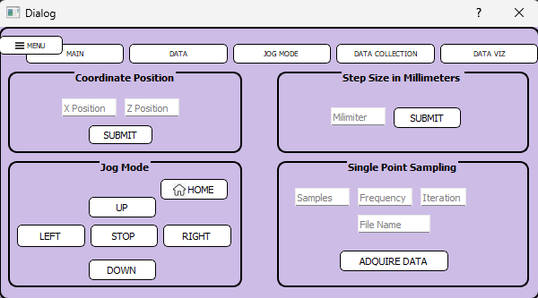
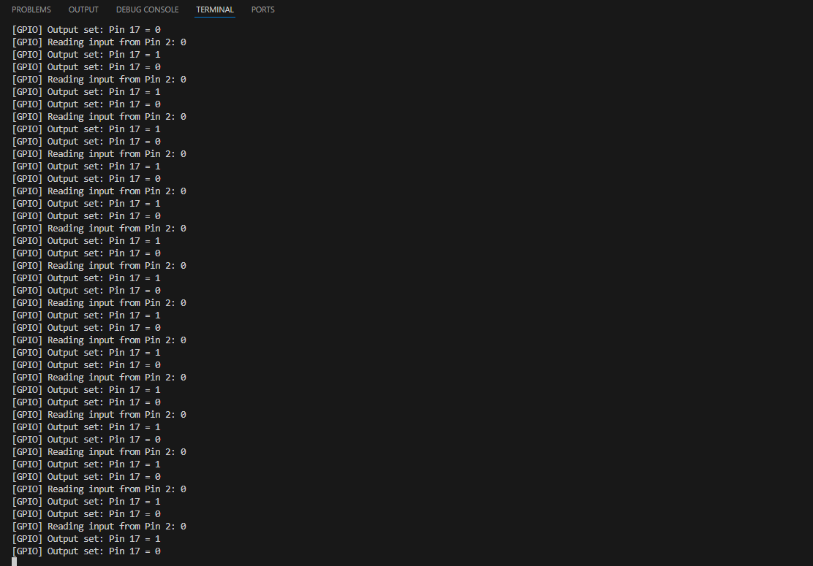

# HotWire PyQT

A simple PyQt-based UI prototype designed to reuse existing Python backend logic from hardware control systems.
This project serves as a lightweight demonstration of UI design and rapid prototyping, integrating previously written Raspberry Pi motor-control code into a desktop environment.


App UI


Terminal showcasing Raspberry Pi pins activated with buttons being pressed 

### Features
- Graphical motor jog interface for moving along X / Z axes.
- Single-point data sampling and coordinate entry sections.
- Collapsible menu bar with navigation buttons.
- Responsive visual layout using Qt Widgets and GroupBoxes styled in soft lavender tones.
- Reuses real backend logic from Raspberry Pi motor control (MotorConfig) with mock GPIO fallback for non-Pi systems

### Commands to try the app:

```bash
git clone https://github.com/IALT1234/IFCS.git
cd IFCS
python menu.py
```


##Dependencies required:
- `pip install PyQt5` — PyQT5
- `sudo apt install python3-rpi.gpio` — PyQT5 (Linux)


## Project structure

Top-level files:

- `menu.py` — Main UI file generated with Qt Designer, containing widget layout and event bindings
- `motor_control.py` — Core backend controlling motor direction, pulse count, limit switches, and relay activation
- `mock_gpio.py` — Lightweight mock class to emulate GPIO operations when testing on desktop systems
- `jog_routes.py` — Flask-based handler from the original web version of the project (used for reference and code reuse)

##UI assets:

- `MENU.ui`, Hamburger_icon.svg.png — Original Qt Designer layout and icon resources.
- `src/App.jsx` — application root
- `src/index.css`, `src/App.css` — global styles

##Purpose:

This project is a conceptual bridge between embedded hardware control and desktop UI prototyping.
It demonstrates:

- How backend code for physical motor control can be reused in a graphical environment.
- Early-stage interface prototyping for eventual integration into a full laboratory automation system.

##Notes

-The UI logic (menu.py) directly connects PyQt buttons to backend movement functions for clarity.
-No external database or web dependencies are required.
-Designed for quick iteration and demonstration of interface responsiveness, layout styling, and code modularity.

